# Insights: Sardinia

Insights: Sardinia (referred to as IS throughout this documentation) is a culture and heritage information/news site, with articles on anything Sardinian from archaeology to art, aimed at people who have a vested interest in the island, and those merely curious.

## Planning Phase

### Aims and Objectives

Since its assimilation into unified Italy around 150 years ago, Sardinia has seen a gradual but steady decline in its unique culture. Outside of the island and mainland Italy it is largely known by German tourists as a beach holiday destination, while the rest of Europe and the world knows either very little about it, or are completely unaware of its existence. IS aims to shed light on aspects of Sardinian culture and heritage that may not be known to the wider global public, in a bid to slow the decline of Sardinian culture. We plan to achieve this by posting interesting and engaging articles on a number of topics, including, but not limited to:
- Culture
- Heritage
- Language
- Politics
- Local characters and their stories

In future each article will have an accompanying video to cater for those who prefer to watch than read.

### Agile Methodology

It was decided that an agile methodology would be implemented during the development of IS. This began with gathering a number of user stories and forming a corresponding epic for each. These epics were then broken down in to smaller tasks to achieve each objective.

Due to the agile nature of the methodology used, as each feature or iteration changed or developed, new ideas would arise and different hurdles would have to be jumped. This meant that our methodology remained malleable throughout the process, so not all of the original epics and tasks match perfectly with the end result.

#### User Stories, Epics and Tasks

Five epic topics were collected from the user stories:
- Admin Panel
- User registration
- Design
- About information
- Comments

A further three were added to these:
- Initial setup
- Databases and models
- Deployment

For more detailed information about each user story/epic and the relevant tasks, please visit the [GitHub Project](https://github.com/users/KitLavis/projects/4/views/1)

### Design

Due to the informative nature of the website, design was kept as simple and as clear as possible, so as not to detract from the information, therefore a simple off white/beige (#faf0e6) was used as the base colour throughout. The serif font "EB Garamond" was used for headings, inkeeping with the newspaper feel of the site, while the sans-serif "Helvetica" font was used for bulk content as it is clearer and easier to read.

#### Wireframing

## Development

### Features

#### Consistent Features

- Navbar

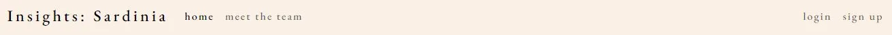

- Footer

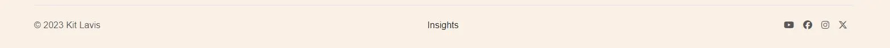

- Messages

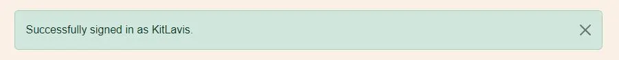

#### Home

- Latest post

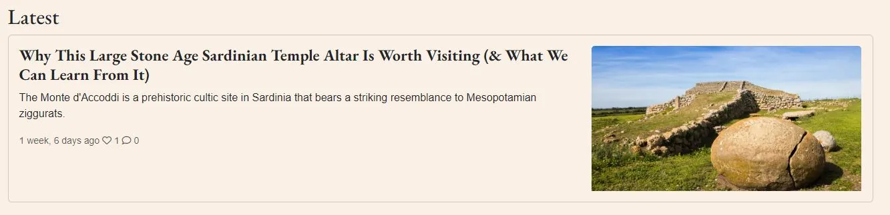

- Other news

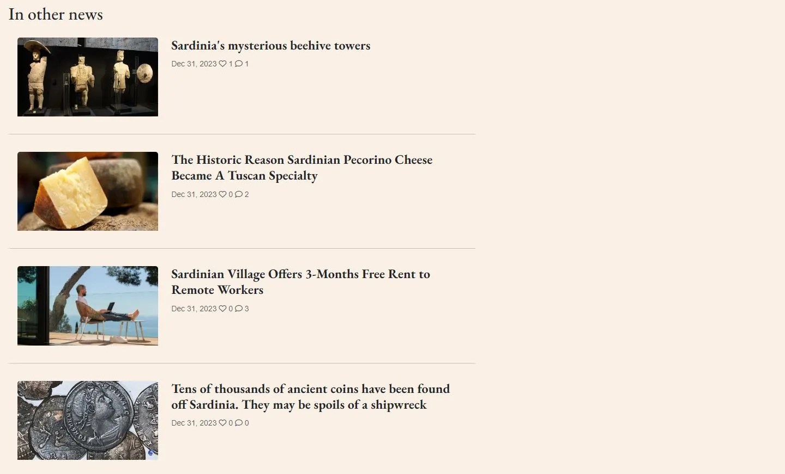

- Pagination

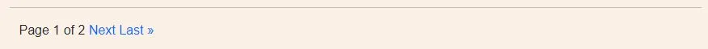

#### Post Detail

- Information and image

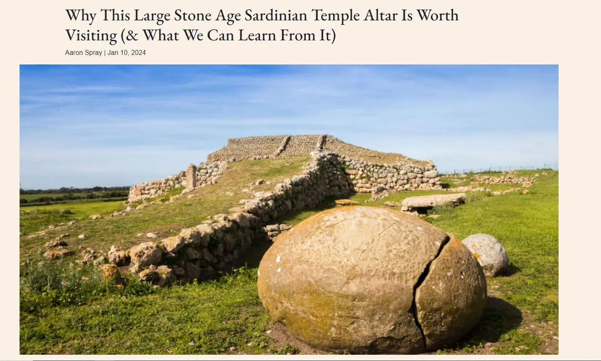

- Post content and likes

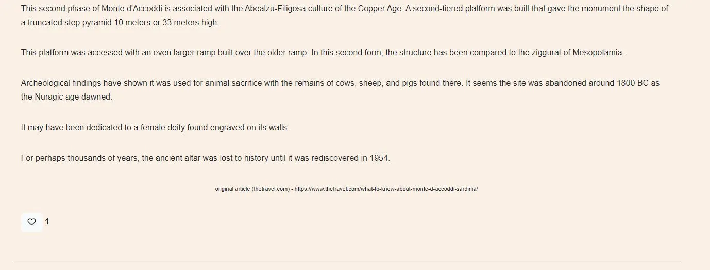

- Comments

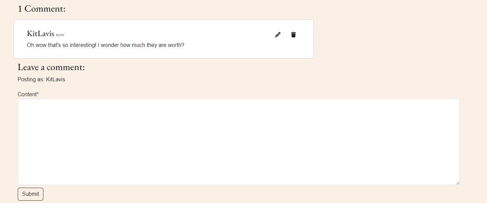

- Edit comment

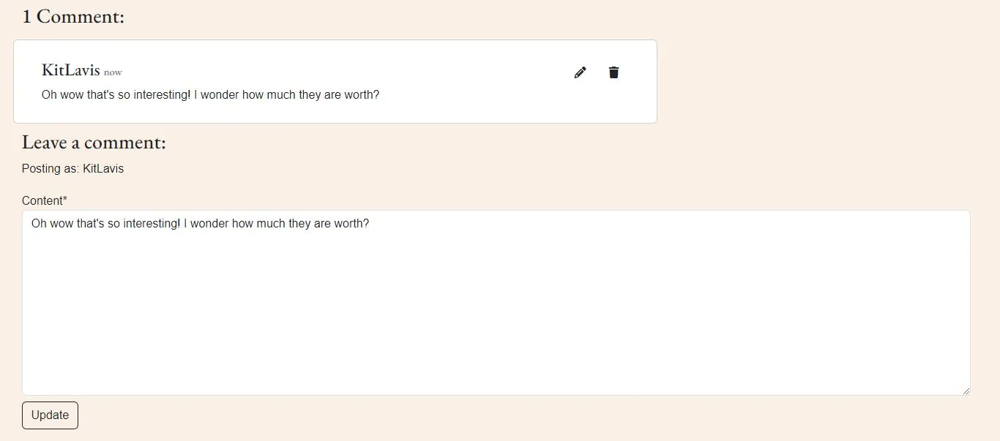

- Delete comment modal

#### Meet the Team

- Contributors

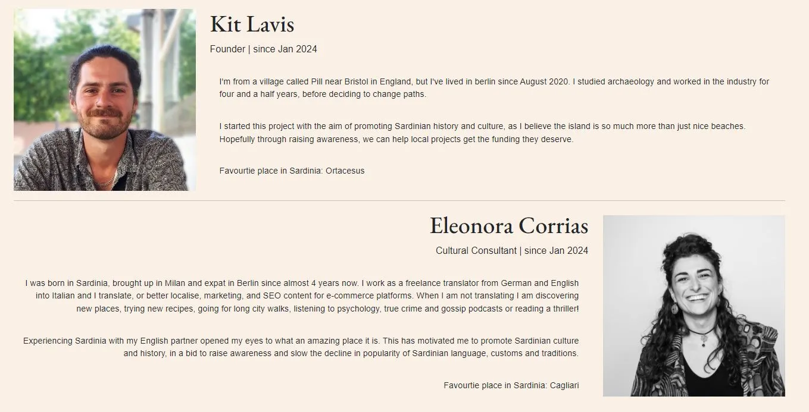

#### Sign in, Sign up, Sign out

- Login

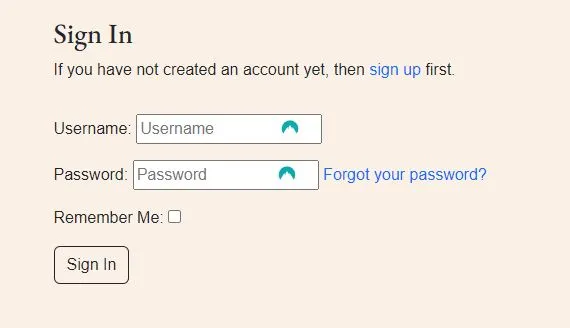

- Incorrect details

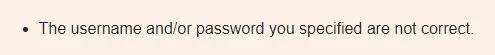

- Forgotten password

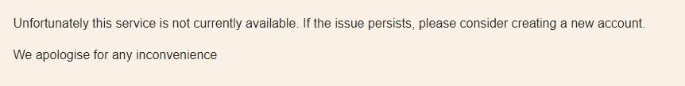

- Register

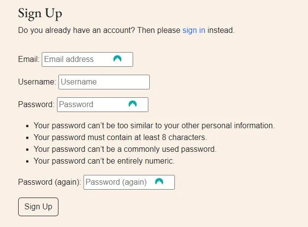

- Logout

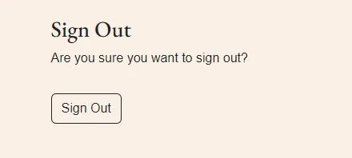

### Future Features

## Deployment

## Testing and Validations

### Manual Testing

### Code Validation

### Challenges and Bugs

## Credits

### Tools and Technologies

### Django Apps and Extensions

### Code Content

### Media and Site Content

