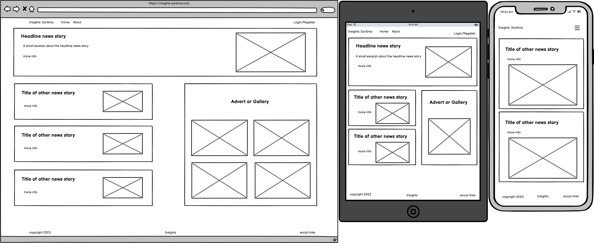
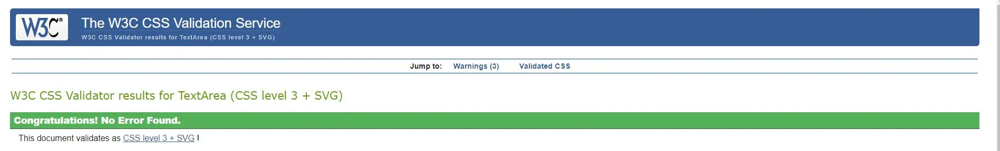

# Insights: Sardinia

Insights: Sardinia (referred to as IS throughout this documentation) is a culture and heritage information/news site, with articles on anything Sardinian from archaeology to art, aimed at people with a global view and an interest in tradtional cultures and customs.

[Live Deployment](https://insights-sardinia-155a5490ffb8.herokuapp.com/)

Since its assimilation into unified Italy around 150 years ago, Sardinia has seen a gradual but steady decline in its unique culture. Outside of Italy, Sardinia is largely known by German tourists as a beach holiday destination, while the rest of Europe and the world knows either very little about it, or are completely unaware of its existence. IS aims to shed light on aspects of Sardinian culture and heritage that may not be known to the wider global public, in a bid to slow the decline of Sardinian culture. We plan to achieve this by posting interesting and engaging articles on a number of topics, including, but not limited to:
- Culture
- Heritage
- Language
- Politics
- Local characters and their stories

In future each article will have an accompanying video to cater for those who prefer to watch rather than read.

## Agile Methodology

It was decided that an agile methodology would be implemented during the development of IS. This began with gathering a number of user stories and forming a corresponding epic for each. These epics were then broken down in to smaller tasks to achieve each objective.

Due to the agile nature of the methodology used, as each feature or iteration changed or developed, new ideas would arise and different hurdles would have to be jumped. This meant that our methodology remained malleable throughout the process, so not all of the original epics and tasks match perfectly with the end result.

### User Stories, Epics and Tasks

Five epic topics were collected from the user stories:
- Admin Panel
- User registration
- Design
- About information
- Comments

A further three were added to these:
- Initial setup
- Databases and models
- Deployment

For more detailed information about each user story/epic and the relevant tasks, please visit the [GitHub Project](https://github.com/users/KitLavis/projects/4/views/1)

## Design

Due to the informative nature of the website, design was kept as simple and as clear as possible, so as not to detract from the information, therefore "linen" (#faf0e6) a simple off white/beige was used as the base colour throughout (see example below). The serif font "EB Garamond" was used for headings, inkeeping with the newspaper feel of the site, while the sans-serif "Helvetica" font was used for bulk content as it is clearer and easier to read.

### Wireframing

- Home page

- About page

- Post detail

## Features

### Consistent Features

As well as the overriding desgin aspects of the project, there are three features that remain consistent throughout: the navbar, the footer, and the pop-up messages.

- Navbar

As is the theme, the navbar is kept as simple as possible while remaining completely functional. The title can be seen at the far left of the feature, which also acts as a link to the home page, next to which is the "home" and "meet the team" (about) links. To the far right of the component is the account links. If a user is not logged in then "login" and "signup" are displayed. If the user is logged in, then "logout" is displayed. Each link is highlighted once the user hovers the cursor over. On smaller devices these navigation links are consolidated into a burger icon.

- Footer

The footer consists of three components: the copyright notice on the left, the title of the project "Insights" in the middle, and links to a number of social media outlets on the right. Currently these links direct the user to the home page of the respective social media outlet, as the project does not currently have a social media presence.

- Messages

When the user interacts with the website, such as signing in/out, registering, leaving a comment, editing a comment or deleting a comment, a message like the example above is displayed.

### Home

The home page is where the user is shown the latest articles uploaded to the site.

- Latest post

At the top of the page the latest post is published in a full width container, akin to a newspaper headline. As is with the rest of the posts displayed below, the comment count and number of likes is displayed here. The whole of this section functions as a link to the page dedicated to the post.

- Other news

Beneath the full width headline comes the next four latest posts, in smaller containers occupying ~66% of the width. Each sections acts as a link to the corresponding post.

- Pagination

Pagination is used so that the home page is not one long stream of information. Four articles are displayed in the "other news" section per page.

### Post Detail

When the user clicks on an article, they are taken to the corresponding post detail page where they can see more information about the article, read the content, and comment on and like the article.

- Information and image

As is custom, the title, author, and date of publication is displayed at the top of the page, followed by the article's image.

- Post content and likes

At the bottom of the actual content of the post comes the like button which an authenticated user can click in order to show their appreciation/interest in the topic.

- Comments

The comments section varies dependant on whether the user is logged in or not, and whether or not there are already comments on the post. The image here is an example of a logged in user commenting on an article that already contains a comment, so the comment count and form are displayed. If the user is not authenticated, they will be encouraged to either login or register. 

- Edit comment

If the user is authenticated and they have left a comment, then a pencil icon appears on that comment. Once clicked the comment form is populated with the existing comment, which can be edited. The submit button is replaced with and update button, to indicate that the comment is being edited rather than submitted for the first time.

- Delete comment modal

If the user is authenticated and they have left a comment, then a dustbin icon appears on that comment. Once clicked the delete modal is displayed, to make sure the user definitely wants to delete thheir comment.

### Meet the Team

- Contributors

The "meet the team" page is an area for the user to learn more about the people behind the project. Here each instance of the contributor model is displayed. This includes their name, their role, when they joined the project, and a brief description of their background and motivations.

### Sign in, Sign up, Sign out

These features allow the user to register an account and sign in/out of that account. Currently their is no account management features for the user, so the "forgotten password" link on the login form redirects to a message explaining this (see below). All forms here are Django allauth forms.

- Login

- Incorrect details

This message is displayed when the user enters incorrect credentials.

- Forgotten password

- Register

- Logout

### Future Features

This is the first iteration of the project, so there are a number of features yet to be added. These include:

- Advertisement
    - In the free space to the right of the "other news" an advertisement could be displayed in order to bring revenue to the project. Further advertising could be displayed in the left and right margins on larger devices
- User account CRUD functionality
    - Currently the only full CRUD functionality available to the user is the comments section. In future the user will be able to manage their account, change email address, password and so on, and have the ability to delete their account if that is their wish.
- Categories
    - A category attribute will be added to the post model to group articles of a similar topic.
- Post search and filter
    - A search bar will be added to the navbar on the home page to allow users to search for specific articles. A filter function will also be added to allow users to filter articles by their category.

## Development and Deployment

### Tools and Technologies

- HTML5, CSS3, Javascript and Python are the languages used for the project.
- Django is the full-stack framework, with a number of apps and extensions added:
    - Allauth for the user account functionality and forms.
    - Crispy Forms for the comment form.
    - Pagination for the pagination of the post list.
    - Summernote to add rich text editing on the Django admin panel.
- Bootstrap is the CSS framework used mainly to provide responsiveness.
- Cloudinary is used for image storage.
- GitHub is used for version control and agile project planning.
- GitPod is the online IDE used.
- ElephantSQL is the database provider.
- The project is deployed using Heroku.

## Testing and Validation

Due to time constraints no automatic tests were written, however an extensive manual test script can be found [here](testing.md)

### Code Validation

- HTML
    - [index.html](https://validator.w3.org/nu/?doc=https%3A%2F%2Finsights-sardinia-155a5490ffb8.herokuapp.com%2F)
    - [contributors.html](https://validator.w3.org/nu/?doc=https%3A%2F%2Finsights-sardinia-155a5490ffb8.herokuapp.com%2Fabout%2Fthe-team)
    - [login.html](https://validator.w3.org/nu/?doc=https%3A%2F%2Finsights-sardinia-155a5490ffb8.herokuapp.com%2Faccounts%2Flogin%2F)
    - [logout.html](https://validator.w3.org/nu/?doc=https%3A%2F%2F8000-kitlavis-insightssardin-36xckim49yh.ws-eu107.gitpod.io%2Faccounts%2Flogout%2F)
    - [password_reset.html](https://validator.w3.org/nu/?doc=https%3A%2F%2Finsights-sardinia-155a5490ffb8.herokuapp.com%2Faccounts%2Fpassword%2Freset%2F)
    - One example of [post_detail.html](https://validator.w3.org/nu/?doc=https%3A%2F%2Finsights-sardinia-155a5490ffb8.herokuapp.com%2Fwhy-this-large-stone-age-sardinian-temple-altar-is-worth-visiting%2F)
    - [signup.html](https://validator.w3.org/nu/?doc=https%3A%2F%2Finsights-sardinia-155a5490ffb8.herokuapp.com%2Faccounts%2Fsignup%2F)
        - The errors shown here are related to the allauth form, not the HTML written for the project

- The raw CSS was passed the [W3C CSS Validator](https://jigsaw.w3.org/css-validator/) with no errors.

- JavaScript

The [JSHint](https://jshint.com/) validator was used for JavaScript validation. Unfortunately no link to our specific test is provided, however the validator came back with just one warning of an undefined variable due to bootstrap.

- Python

Every element of custom python written for the project was passed through the [Code Institute's Python linter](https://pep8ci.herokuapp.com/) and no errors were found. Unfortunately, the specific test cannot be linked.

- Lighthouse Report

Chrome's DevTools lighthouse report was used to get an overall report on the performance of the site.

### Challenges and Bugs

## Credits

### Code Content

- The project itself is heavily based on the Code Institute's [Django Blog walkthrough project](https://github.com/Code-Institute-Solutions/Django3blog), especially the JavaScript for comment functionality.
- The JavaScript to add the active class to the navbar links is by user Prosper Atu on [Stack Overflow](https://stackoverflow.com/questions/72050328/add-active-class-to-navbar-element-when-clicked).
- Layout of the home page was inspired by Kristyna Wach's [Fantastic News](https://github.com/Cushione/fantastic-news/tree/main)

### Media and Site Content

- All articles and their respective images are from outside sources used for example purposes to show the kind of content that would fit the project. They can be found here:
    - Aaron Spray [thetravel.com](https://www.thetravel.com/what-to-know-about-monte-d-accoddi-sardinia/)
    - Kiki Streitberger [bbc.com](https://www.bbc.com/travel/article/20221017-nuraghi-sardinias-mysterious-beehive-towers)
    - Nikita Ephanov [tastingtable.com](https://www.tastingtable.com/1458893/historic-sardinia-pecorino-cheese-tuscany/)
    - Arta Desku [schengenvisainfo.com](https://www.schengenvisainfo.com/news/sardinian-village-offers-3-months-free-rent-to-remote-workers/)
    - [apnews.com](https://apnews.com/article/italy-ancient-coins-sardinia-divers-cabdfa070d37a8020f874dd90c0a2433)
    - Tzvetozar Vincent Iolov [themayor.eu](https://www.themayor.eu/en/a/view/did-you-know-that-it-s-illegal-to-take-pebbles-from-sardinian-beaches-12058)
    - Bridget Ryder [europeanconservative.com](https://europeanconservative.com/articles/news/sardinian-sheepherders-pass-tradition-to-kyrgyz-muslims/)
- All icons are from [Font Awesome](https://fontawesome.com/icons)
- Wireframes were created using Balsamiq